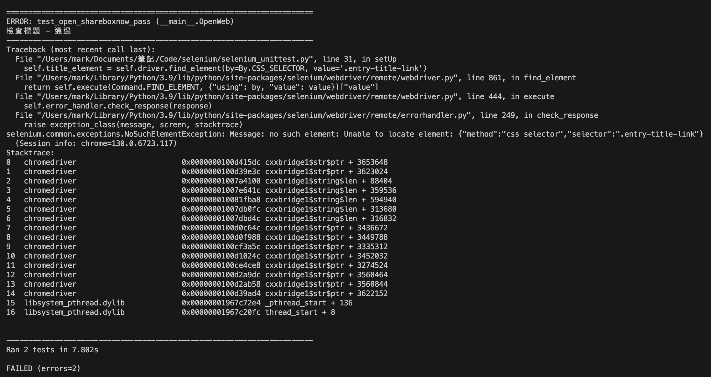
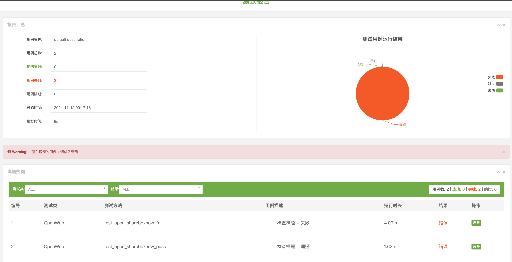

# selenium


## 安裝指令

```sh
pip3 install --upgrade webdriver-manager
```

## 執行指令

一般的顯示在終端機的測試結果

```sh
python3 selenium_unittest.py
```



---

產生報告的測試結果，執行完後會顯示在對應的位置產生 image.png 檔案

```sh
python3 selenium_unittest_beautiful_report.py
```


